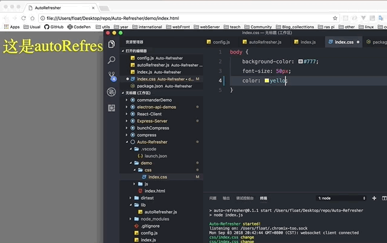

# Auto-Refresher
A repository which can open and refresh your bowser when your file update

**一个可以 可以在文件更新时自动刷新浏览器的小脚本**


### 前言

习惯了现代化的web开发方式（webpack热刷新）， 再做传统项目就有点不习惯。 传统web项目，有着多样的文件（php， html 等）， 多种技术选型（iframe ， 单页应用 等），对每个项目进行webpack 配置也是一件十分耗费精力的事情， 毕竟开发环境下加载本地文件也不消耗网络带宽， 浏览器刷新是一件十分廉价的事情。而且最近笔者的 **F5 刷新键被按坏了**， 在此背景下， 笔者再也不想在手动刷新浏览器来看效果了，那就借助node 的文件检测机制 和 chromix 来写一个自动刷新浏览器的小脚本吧 


### 配置&下载


##### 服务器缓存控制

在下载使用 Auto-Refresher 之前， 先修改本地服务器的缓存策略， 不然浏览器刷新没有任何意义。不同的本地服务器有着不同的配置，但是思路是一致的，就是设置服务器返回头的 **Expires** 字段或者 **Cathe-control** 字段，  这里以appache 和 node 的 httpServer为例。

* **apache**

  找到 **httpd.conf**文件， 这个文件是 apache 服务器的主要配置文件, 修改参考如下

  ```bash
  # 第一种方法
  LoadModule expires_module modules/mod_expires.so
  ExpiresActive On
  # html文档的过期时间为 从上次访问（A）开始 10 秒钟
  ExpiresByType text/html A10
  ExpiresByType image/gif A2592000
  # HTML文档的有效期是最后修改（M）时刻后的一星期
  ExpiresByType text/html M604800
  ExpiresByType text/css N1000
  ExpiresByType text/js "now plus 2 days"
  ExpiresByType image/jpeg "access plus 2 months"
  ExpiresByType image/bmp "access plus 2 months"
  ExpiresByType image/x-icon "access plus 2 months"
  ExpiresByType image/png "access plus 2 months"
  
  # 第二种方法
  LoadModule headers_module modules/mod_headers.so
  header set cache-control "max-age=1000"
  ```

* **httpServer**

  与 apache 服务器不同, node 的 httpserver响应头是由用户控制的， 并不是配置文件控制的。

  ```js
  const http = require('http')
  http.createServer((req, res) => {
      res.setHeader('Expires', `${new Date() + 1000}`)
      res.setHeader('Cache-Control', 'max-age=10')
  })
  ```


##### 下载chrome 的 chromi 插件

Windows 系统 点击下载[chromi](https://chrome.google.com/webstore/detail/chromi/eeaebnaemaijhbdpnmfbdboenoomadbo)谷歌浏览器插件并安装

Uinx 系统下载 点击下载[chromix-too](https://chrome.google.com/webstore/detail/chromix-too/ppapdfccnamacakfkpfmpfnefpeajboj?utm_source=chrome-ntp-icon)谷歌浏览器插件并安装


##### 下载Auto-Refresher

```shell
# 拷贝仓库
git clone https://github.com/zexiplus/Auto-Refresher.git

# 打开文件夹
cd Auto-Refresher

# 安装依赖
npm install
```


### 运行




**1.打开demo文件夹中的index.html， 任意修改demo文件夹下的文件， 观察浏览器自动刷新**

* **读取配置文件 config.js 运行**


  **config.js** 

  ```js
  const path = require('path')
  const config = {
      path: path.resolve(__dirname, './demo'),
      index: 0,
      deep: true
  }
  module.exports = config
  ```

  ```shell
  npm start
  ```

  - **path** 为开发目录

  - **index**为浏览器的tab索引 第一项为0

  - **deep** 取值1 为深度检测, 0 为浅检测


**2.打开demo文件夹中的index.html， 任意修改demo文件夹下的文件， 观察浏览器自动刷新**

* **根据命令行参数运行**

  ```shell
  node index.js path index deep
  ```

  * **path** 为开发目录
  * **index**为浏览器的tab索引 第一项为0
  * **deep** 取值1 为深度检测, 0 为浅检测

### 协议 

* MIT